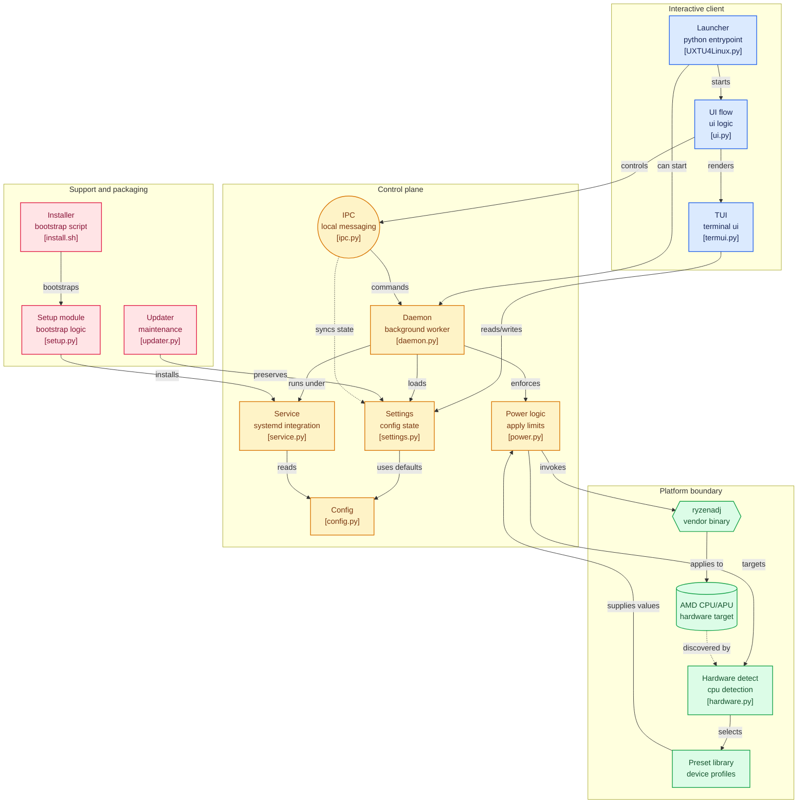

<picture></picture>
 
[](https://github.com/HorizonUnix/UXTU4Linux/releases)
[](https://github.com/HorizonUnix/UXTU4Linux/releases/latest)
[](https://www.python.org/)
[](LICENSE)
  
## Overview
 
UXTU4Linux is a power management tool for **AMD Ryzen APUs and CPUs** on Linux (and formerly macOS). It wraps [RyzenAdj](https://github.com/FlyGoat/RyzenAdj) with an interactive terminal UI and a background systemd daemon, letting you apply and auto-switch power presets without touching the BIOS.
 
**Key features:**
- Premade presets for a wide range of AMD APUs and desktop CPUs
- Dynamic Mode - auto-switches between presets on AC vs. battery
- Auto-reapply on a configurable timer via background daemon
- Built-in updater with config backup and restore
---
 
## Compatibility
 
| Platform | Status |
|----------|--------|
| Linux - systemd, Python 3.10+ | ✅ Actively supported |
| macOS 11 -> 26 | ⚠️ Deprecated as of v0.5.22 [Wiki](https://github.com/HorizonUnix/UXTU4Linux/wiki/macOS-Installation-and-Troubleshooting) |
 
> [!IMPORTANT]
> **systemd is required.** Distros using OpenRC, runit, or other init systems are partially supported.
 
---
 
## Installation
 
```bash
curl -fsSL https://raw.githubusercontent.com/HorizonUnix/UXTU4Linux/main/install.sh | bash
```
 
For full details, troubleshooting, and manual steps see the **[Wiki](../../wiki)**.
 
## Usage

```bash
uxtu4linux
```

## Diagram



---
 
## Preview
 
<p align="left">
  
  
  
  
  
  
</p>
 
## Acknowledgments
 
| Contributor | Contribution |
|-------------|-------------|
| [b00t0x](https://github.com/b00t0x) | Guidance on building ryzenadj with DirectHW and pciutils-osx |
| [FlyGoat](https://github.com/FlyGoat) | [RyzenAdj](https://github.com/FlyGoat/RyzenAdj) |
| [JamesCJ60](https://github.com/JamesCJ60) | [UXTU](https://github.com/JamesCJ60/Universal-x86-Tuning-Utility) preset design and inspiration |
| [corpnewt](https://github.com/corpnewt) | macOS `.command` launcher template |
| [NotchApple1703](https://github.com/NotchApple1703) | Advisor |
 
